# Google Data Analytics Capstone: Cyclistic Bike-Share Analysis 
## Background

### Introduction
Welcome to my first case study! This is the capstone project for the Google Data Analytics Certificate program. I will be following the data analysis process: Ask, Prepare, Process, Analyze, Share, Act in order to answer key business questions. My report will include the following deliverables:
1. A clear statement of the business task
2. A description of all data sources used
3. Documentation of any cleaning or manipulation of data
4. A summary of the analysis
5. Supporting visualizations and key findings
6. Top three recommendations based on the analysis

### Scenario
I am a junior data analyst on Cyclistic’s marketing analytics team. Cyclistic is a bike-share company that offers a fleet of 5,824 bicycles in a network of 692 stations across Chicago. Cyclistic has two main types of customers: casual riders and annual members. Casual riders are customers who purchase single-ride or full-day passes while annual members are customers who purchase annual memberships.

The Cyclistic financial team has identified that annual members are much more profitable than casual riders. The director of marketing believes that maximizing the number of annual members will be key to future growth. I have been given the task of understanding how annual members and casual riders use Cyclistic bikes differently. The insights from this analysis will aid in achieving the end goal: design marketing strategies aimed at converting casual riders into annual members. 

## Ask

### Problem Definition
The marketing director would like to propose marketing strategies aimed at converting casual riders into annual members to Cyclistic’s executive team. The executive team will be responsible for approving the recommended program. In order to provide data-driven recommendations, the marketing director’s team (my team) needs to better understand how annual members and casual riders use Cyclistic bikes differently, why casual riders would buy a membership, and how digital media could affect marketing tactics. I have been assigned to answer the question: how do annual members and casual riders use Cyclistic bikes differently? 

### Business Task
Analyze the Cyclistic historical bike trip data to identify trends in how casual riders and annual members use Cyclistic bikes differently.

## Prepare

### Data Sources
Bike trip data was downloaded from this [link](https://divvy-tripdata.s3.amazonaws.com/index.html). This is public data that has been made available by Motivate International Inc. under this [license](https://divvybikes.com/data-license-agreement). 

Cyclistic’s previous 12 months (April 2024 - March 2025) of bike trip data will be used to analyze and identify trends. The data provided meets the criteria of “good” data, meaning it is reliable, original, comprehensive, current, and cited. The data is provided by Cyclistic and contains all information needed to understand the different ways casual riders and annual members use Cyclistic bikes. 

### Data Organization
There are 12 separate CSV files, named YYYYMM-divvy-tripdata.csv, that contain bike trip data for the month. The data is structured, meaning it is organized into rows and columns. Each row represents one trip, which is uniquely identified by the ride_id. The following information is provided about each trip taken:
- ride_id: unique string identifying the ride id
- rideable_type: bike type 
- started_at: trip start date and time
- ended_at: trip end date and time
- start_station_name: trip start station name
- start_station_id: trip start station id
- end_station_name: trip end station name
- end_station_id: trip end station id
- start_lat: trip start latitude 
- start_lng: trip start longitude
- end_lat: trip end latitude
- end_lng: trip end longitude
- member_casual: customer type (annual member versus casual rider)

## Process

### Tools Used
BigQuery was used to both preview and clean the data due to its size. For reference, the March 2025 dataset had over 200,000 rows. 

In order to process the data in BigQuery, I first downloaded each CSV file containing bike trip data from April 2024 to March 2025. I stored each file in a Google Cloud Storage bucket. I created a dataset called bike_trips in BigQuery and uploaded each CSV file into 12 different tables in the bike_trips dataset. 

I then created a table, bike_trips_combined_data, to combine the past 12 months of bike trip history into one table. Here is the code I used: 
[Combining tables code](code/Combine_all_tables.sql).

### Data Cleaning and Manipulation
I first checked for any duplicate rows and found none. I also checked if there were any duplicate ride_id entries as this should be a unique value. I compared the total number of ride_id entries (5,779,568) to the total number of distinct ride_id entries (5,779,357) and found there were 211 duplicates. I gathered which ride_ids were duplicated and then further investigated why there may be duplicate ride_id entries. To do so, I sampled a ride_id to see why the ride_id field was duplicated but not the entire row. 

| ride_id          | rideable_type | started_at                     | ended_at |
| ---------------- | ------------ | ------------------------------ |---------------------- |
| 1B57E6F3A5495300 | classic_bike | 2024-05-31 23:34:14.210000 UTC | 2024-06-01 00:22:46.368000 UTC |
| 1B57E6F3A5495300 | classic_bike | 2024-05-31 23:34:14.000000 UTC | 2024-06-01 00:22:46.000000 UTC |

I found that the started_at and ended_at columns both contained information that was slightly different. One entry had the started_at and ended_at columns display a value for milliseconds, while the other did not. In order to ensure the data is consistent, I decided to update the started_at and ended_at columns. To do so, I truncated the started_at and ended_at columns to only include the second, not millisecond.

From initial inspection, I identified the following additional columns that would be useful to add for further analysis:
- Ride length (minutes)
- Ride start month
- Ride start day
- Ride start hour

I calculated the length of each ride by subtracting the column started_at_clean from the column ended_at_clean and stored the result in a new column named ride_length_minutes. I calculated the ride start month, day, and hour by extracting this information from the started_at_clean column and stored the results into the month_start, week_start, and hour_start columns, respectively. 

I then created a temporary table that had all duplicates removed and included the additional columns. I used this temporary table to check if there were any null values. The following columns had null values: 

| Column Name | Count of Null Values |
| ----------- | -------------------- |
| ride_id_null | 0 |
| rideable_type | 0 |
| started_at_clean | 0 |
| ended_at_clean | 0 |
| start_station_name | 1091207 |
| start_station_id | 1091207 |
| end_station_name | 1120839 |
| end_station_id | 1120839 |
| start_lat | 0 |
| start_lng | 0 |
| end_lat | 6549 |
| end_lng | 6549 |
| member_casual | 0 |

I removed all rows that had null entries. I saved the table with no duplicate or null values as a temporary table so that I could check the data for any common errors or mistakes. First, I checked that the member_casual column only consisted of the two known member types: casual riders and annual members.

| member_casual | Count |
| ------------- | ------- |
| member | 2598752 |
| casual | 1501263 |

Next, I checked that the rideable_type column consisted of different bike types.

| rideable_type | Count |
| ------------- | --------|
| classic_bike | 2576727 |
| electric_bike | 1475461 |
| electric_scooter | 47827 |

Then, I checked that the ride_id had a consistent length. All ride_id entries were the same length, 16 characters. 

Finally, I confirmed that the ride length previously calculated was greater than 0, as a ride length less than or equal to zero would indicate there was not a bike trip taken or error in the system. There were 137 records with this error. I confirmed the error was due to the started_at time occurring after or at the same as the ended_at time. I would recommend the reason for this error be further investigated. For this case study I decided to remove these records from the dataset to prevent these outliers from skewing the data. 

Now that I had a complete understanding of the data and where errors or inconsistencies were present, I created a query to clean the dataset and completed the following: 
- Created a new dataset that included six new columns: started_at_clean, ended_t_clean, ride_length_minutes, month_start, week_start, hour_start
- Removed any rows with null values
- Removed duplicate ride_id entries
- Removed instances where ride length was less than zero

I stored the results in a new table called bike_trips_clean. This table had a total of 4,099,878 rows remaining and ready for analysis.

Below is the code I used to clean and process the data:
- [Checking for duplicate values](code/Check_for_duplicate_values.sql)
- [Checking for incorrect data](code/Check_for_incorrect_data.sql)
- [Checking for null values](code/Check_for_null_values.sql)
- [Creating clean dataset](code/Clean_data.sql)

## Analyze & Share

### Tools Used
I used BigQuery to analyze the data and Tableau Public to visualize it. 

### Data Analysis
I began my analysis by understanding what percent of the dataset was represented by casual riders versus annual members. Below is the breakdown of the dataset:

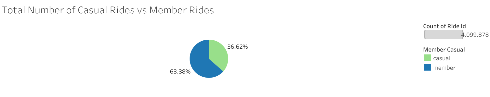

Out of 4,099,878 total rides over the year, 63% were by annual members, while 37% were by casual riders. 

Next, I completed some basic calculations to understand how different member types use Cyclistic bikes. 

| Member Type | Average Ride Length (minutes) | Number of Rides |
| ----------- | ----------------------------- | --------------- |
| Any | 16.6 | 4099878 |
| Casual | 23.9 | 1501202 |
| Member | 12.4 | 2598676 |

On average, casual riders take longer rides than annual members, however they take fewer riders overall. To investigate this further, I analyzed the total number of rides and average ride length by member type. I broke down the analysis by month, day of the week, and hour of the day to better understand how casual riders and annual members use Cyclistic bikes differently. 

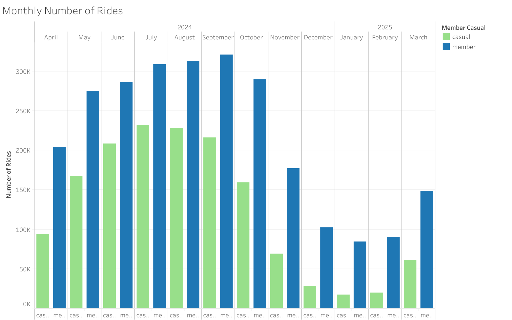

Annual members use Cyclistic bikes more frequently than casual riders across all months of the year. However, both member types exhibit similar riding behavior, with more rides occurring in the summer months (June through September) and less rides in the winter months (December through February). 

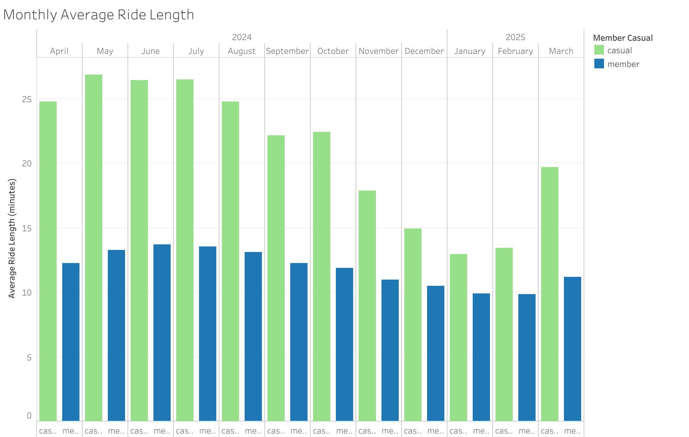

On average, casual riders take longer rides than annual members across all months of the year. Casual riders take longer rides in the summer months and shorter rides in the winter months. Annual members, on the other hand, have a more consistent average ride length over all months of the year. 

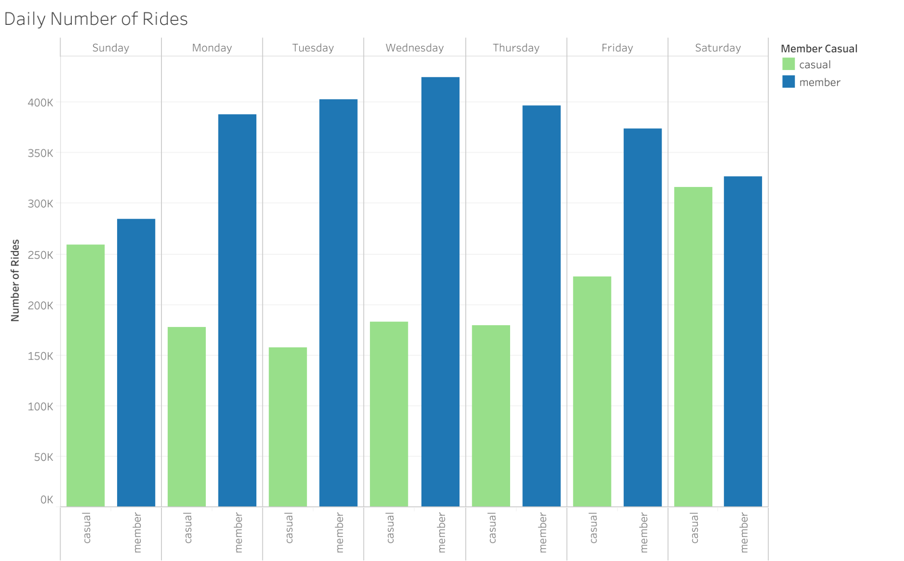

Casual riders and annual members favor different days of the week. Annual members take more rides during the week days, with Wednesday having the highest number of rides. Casual riders take more rides during the weekends, with Saturday having the highest number of rides. This indicates that annual members are using Cyclistic bikes to commute to/from work, whereas casual riders are using Cyclistic bikes for leisure during the weekends. 

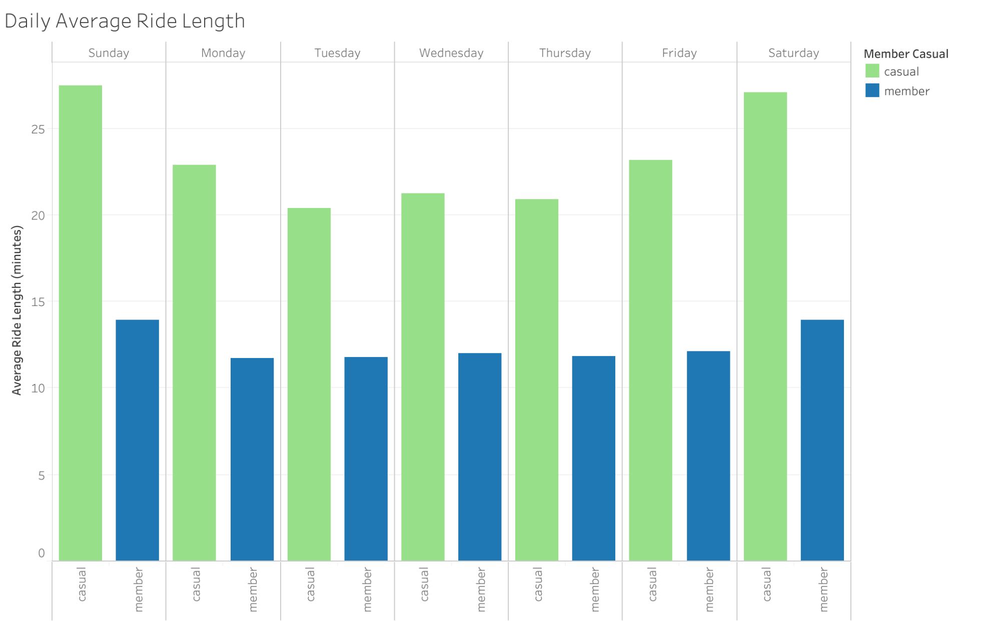

Casual riders take longer rides during the weekends than the weekdays.  Annual members have a more consistent average ride length across all days of the week. 

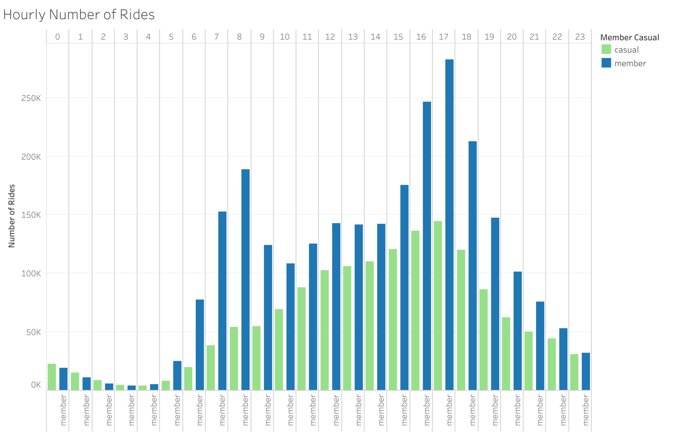

Both casual riders and annual members take the most rides in the late afternoon, with 5 pm being the most popular ride time. The number of trips taken by casual riders increases consistently throughout the day until the evening. This differs from annual riders, whose ride frequency peaks in the morning, from 6 am to 9 am, as well as the evening, from 4 pm to 6 pm. This trend supports the conclusion that annual members are using Cyclistic bikes to commute to and from work whereas casual riders are using Cyclistic bikes for leisure activities during the day. 

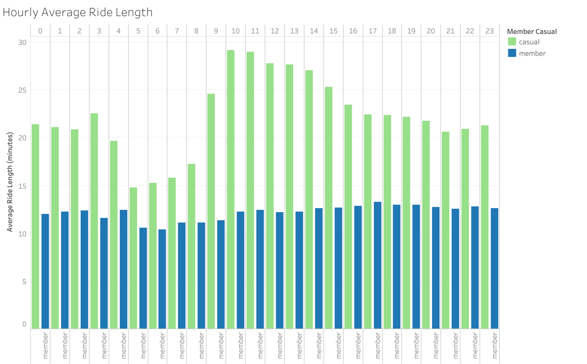

Casual riders take longer rides during the day and shorter rides in the morning. Annual members have a more consistent average ride length across the different times of day. 

I now have insights into how casual riders and annual members use Cyclistic bikes differently based on the month, day of week, and hour of the day. To strengthen my analysis, I identified additional differences between member types based on bike type, start station use, and end station use.

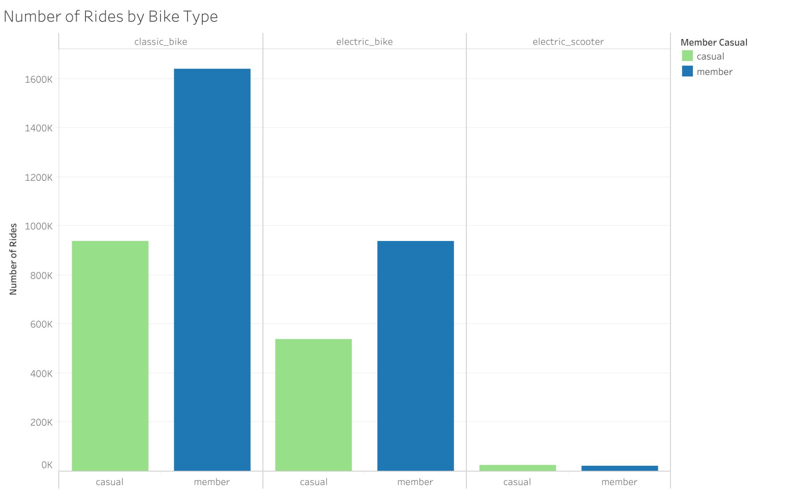

Both annual members and casual riders most frequently use the classic bike and least frequently use the electric scooter. 

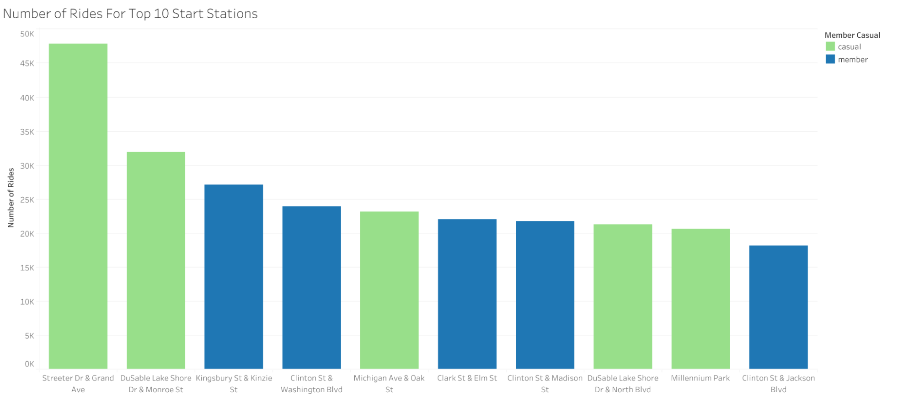

An analysis of the top start stations revealed clear differences between casual riders and annual members. Casual riders use start stations near Chicago landmarks and monuments. For example, the top start station used by causal riders, Streeter Dr & Grand Ave, is an intersection near Navy Pier, a popular Chicago landmark. Furthermore, more recognizable names such as Michigan Ave and Millennium park appear in the top 5 start stations used by casual riders. On the other hand, annual members use start stations in more residential and commercial areas. For example, the top start station used by annual members, Kingsbury St & Kinzie St, is a popular residential area. 

I also mapped the start station use between the different member types. The first map shows the distribution of start station use by annual members while the second map shows the distribution of start station use by casual riders. 

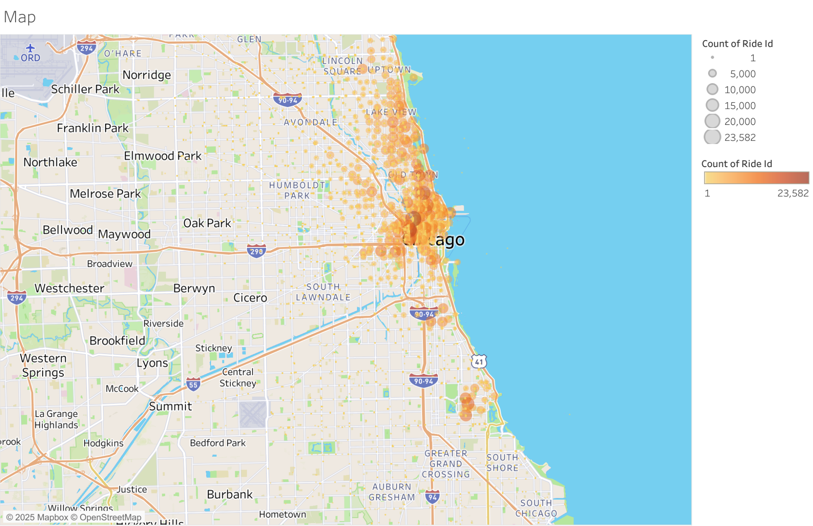
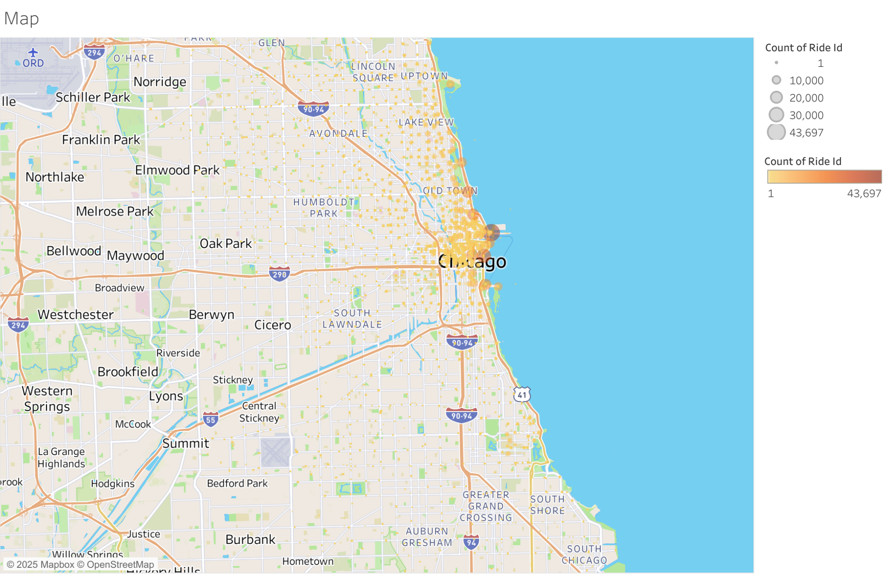

The maps show that annual members use start stations all across Chicago, including many in the suburban areas. Casual members use start stations more heavily concentrated within the Chicago area. This further supports the conclusion that casual riders are using Cyclistic bikes for leisurely activities such as visiting popular Chicago landmarks and parks whereas annual members are using Cyclistic bikes for commuting to and from work, starting their ride in residential and commercial locations. 

With the analysis complete, I can address the business task of analyzing the Cyclistic historical bike trip data to identify trends in how casual riders and annual members use Cyclistic bikes differently. Here are key trends I identified:
1. Annual members are primarily using Cyclistic bikes to commute to and from work, using bikes most commonly on weekdays during commuting hours (6am - 9 am and 4 pm - 6 pm). Casual riders are primarily using Cyclistic bikes for leisure or recreation, using bikes most commonly on weekends during the day. 
2. Both annual members and casual riders use Cyclistic bikes more in the summer months and less in the winter months.
3. Annual members take shorter, more frequent rides, whereas casual riders take longer, less frequent rides.
4. Annual members typically begin their rides in residential and commercial locations. Casual riders typically begin their rides in areas with popular landmarks or parks.

Below is the code I used to perform the calculation and analysis:
- [Calculations code](code/Calculations.sql)
- [Analysis code](code/Analysis.sql)

## Act

Based on the conclusions drawn from the analysis, I am able to make several recommendations to aid in achieving the end goal: design marketing strategies aimed at converting casual riders into annual members. 

### Recommendation 1
Begin marketing campaigns in the spring, focusing on the benefits of becoming an annual member. To encourage casual riders to become annual members, consider offering a seasonal summer discount, as this is when bikes are most commonly used. 

### Recommendation 2
Focus marketing efforts in locations most popular among casual riders, such as around Navy Pier or other popular tourist attractions in Chicago. Consider partnering with popular attractions, such as museums and parks, to offer discounts for those who are Cyclistic members. This would incentivise casual riders to become annual members. 

### Recommendation 3
Incentivize casual riders to become members by offering member-only discounts or benefits for rides over a certain length. This would encourage casual riders, who use bikes for a longer period of time, to become members in order to earn rewards or discounted rides. 

